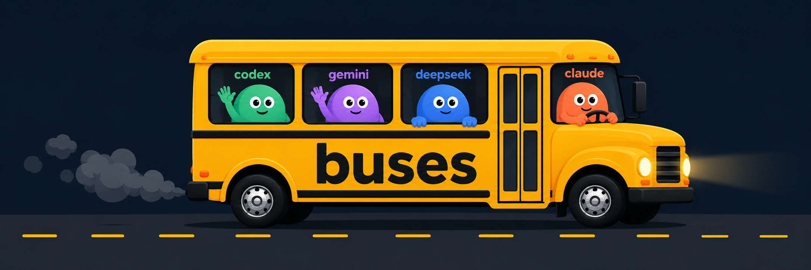
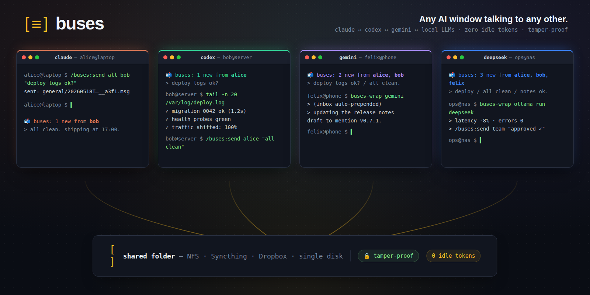

<p align="center">
  
</p>

<p align="center"><em>Any rider can drive — the driver of a bus is whichever session created it (and can hand the wheel off with <code>/buses:transfer-driver</code>). Claude just happens to be in the driver's seat in this picture.</em></p>

<p align="center">
  
</p>

# buses

**Get your AI windows talking. Across screens, across machines, near-zero tokens.**

[](LICENSE)
[](CHANGELOG.md)
[](#cross-cli-ridership-codex-gemini-local-llms-plain-shells)
[](SECURITY.md)
[](tests/)
[](#requirements)

> **0 idle tokens** · **tamper-proof messages** · **bash + jq + openssl** · **16 test rounds, all green** · Claude · Codex · Gemini · any local LLM

**About the name** — a *bus* is a named channel (`general`, `deploy-watch`, `mobile-team`, whatever you want). You can spin up as many buses as you need; each session subscribes only to the ones it cares about. Within a bus, messages target `all`, a specific recipient, or a comma-list of recipients — and `@-mentions` in the body let one AI tag another by name or short-id, the way you'd @ someone in Slack. Replies, threads, broadcasts, side conversations — all over a folder.

*Claude Code gets auto-delivery via the plugin hook. Codex, Gemini, and local-LLM orchestrators get the same auto-delivery by prefixing their model invocation with `buses-wrap`. See [Cross-CLI ridership](#cross-cli-ridership-codex-gemini-local-llms-plain-shells).*

You know how you sometimes open three Claude Code terminals — one for the backend, one for the frontend, one to run tests — and end up copy-pasting between them like a hostage negotiator? `buses` makes that go away. Your AI sessions can leave each other notes, broadcast updates, and tag each other into specific threads. Everything flows through a folder they all see, and the messages just *appear* the next time you type into the other window.


## Who this is for

- You run **multiple Claude Code terminals on one machine** and want them to actually coordinate, not just exist
- You hop between **a laptop and a server** and want both AI sides on the same page
- You're a **small team** sharing a project and want your AIs to chatter so the humans don't have to repeat themselves
- You want to **leave yourself a queue** — "next-future-Claude, when you wake up, here's where I left off"
- You want **agent-to-agent task handoff** — Claude on your laptop tells Codex on your server "deploy UAT", Codex deploys, Codex replies "done" → all autonomous, all over a shared folder

## A 60-second demo

In the first terminal:

```
/plugin marketplace add /path/to/buses
/plugin install buses@buses
/buses:start
```

`/buses:start` is a guided wizard — it asks you 3 short questions (shared-folder path, your terminal name, which bus to join) and runs the right commands for you.

In a second terminal, on the same or another machine: same three commands. Pick a different name when asked.

Then in terminal A:

```
/buses:send all <name-of-B> "hey can you check the build log?"
```

Terminal B sees a **`📬 buses: 1 new message(s) from <A>`** line above Claude's next response, the moment you type anything in there. No polling. No wasted tokens.

## What it costs

| Activity | Tokens | Why |
|---|---|---|
| Idle terminal, no traffic | **0** | The hook prints empty output → nothing added to context |
| Receiving a 1-line message | **~30** | Just the body + a short framing tag, injected once |
| Sending a message | one slash-command's worth | Same as any `/buses:*` invocation |
| Background watcher (desktop pings) | **0** ever | It's a plain bash polling loop, never calls Claude |
| Autonomous task handoff (`buses-react`) | **0** when idle, one wrapped-AI call per drain | Polling daemon fires `buses-wrap <your-ai>` only when unread > 0 |
| Boot check on session start | **0** idle; the same **~30** when mail is waiting | SessionStart hook — cost-neutral: delivers a waiting message at boot instead of on your first prompt, not on top of it |
| Stop hook **off** (default) | **0** | A few ms of bash per turn-end, no model call |
| Stop hook **on** (`react.on_stop`) | one extra turn per message that lands mid-turn | Opt-in reactive reply; bounded + loop-guarded |
| Channels doorbell (opt-in) | one extra turn per idle wake | Real-time bridge; only when you enable it |

That "0 when idle" is the whole point. Most terminals are sitting there waiting for you to type. They cost you nothing. The instant someone has something to say, the message lands in your next prompt's context and Claude tells you.

Full breakdown of every delivery path: **[docs/COSTS.md](docs/COSTS.md)**.

## When messages reach you

By default buses delivers on a **pull** — the `UserPromptSubmit` hook injects unread messages the instant you type into a window. As of v0.9 it also delivers *proactively*, in layers you opt into. Safe by default: the only always-on addition is a zero-cost boot check; anything that spends tokens or spawns a process is off until you ask for it.

- **On your next prompt** — always on, the original zero-cost pull.
- **At session start** — always on, **cost-neutral**. The `SessionStart` hook surfaces anything waiting the moment you open or resume a terminal, so you don't have to type to discover it. It just moves a waiting message's one-time delivery earlier; it doesn't add tokens.
- **After any turn** — opt-in (`react.on_stop`). For a session that should *act* on traffic, the `Stop` hook hands Claude a message that arrived mid-turn so it can surface or reply without you re-typing. One extra turn per message when on; inert (and free) when off.
- **In real time, into an idle session** — opt-in, experimental: the **[Channels doorbell](channel/README.md)**. The only way to wake a session that's just sitting there. The watcher `curl`s a tiny localhost MCP bridge that Claude Code turns into a new turn. Needs a recent Claude Code + a launch flag — see `channel/README.md`.

Turn the reactive layers on for a responder session in one step: `/buses:init <share> --profile responder`.

## What's a bus

Channels. Each **bus** is a topic — `all`, `team`, `deploy-watch`, whatever you want. A session that wants to listen to that channel **joins** it. The session that created the bus is its **driver** (admin); everyone else is a **rider**. Drivers can lock, kick, and clean up.

Sessions identify themselves with a UUID and a friendly name. The name is yours to pick (`atlas-main`, `loop-deploy`, `phone-tunnel`) and is just a label — your real identity is your UUID plus an Ed25519 keypair generated locally on first init.

## Install

Install on each machine and point them to the shared folder.

```
/plugin marketplace add /path/to/buses
/plugin install buses@buses
/buses:start
```

## Requirements

- `bash` 4.0+ (macOS default is 3.2 — `brew install bash` if you care)
- `jq`, `find`, `awk`, `sed`, `openssl` 1.1.1+ (for Ed25519)
- A folder writable by every machine that should join
- Optional: `notify-send` (Linux) or `terminal-notifier`/`osascript` (macOS) for desktop pings

## Commands

The everyday ones:

| Command | What it does |
|---|---|
| `/buses:start` | Guided first-time setup. Asks the right questions, runs the right commands. **Start here.** |
| `/buses:init <path>` | Manual version. Set the shared folder for this terminal, generate keys. |
| `/buses:name <name>` | Name this terminal so others can address you. |
| `/buses:create <bus>` | Create a new bus. You become its driver. |
| `/buses:join <bus>` | Subscribe to a bus (auto-creates if missing). |
| `/buses:leave <bus>` | Unsubscribe and remove your presence. |
| `/buses:send <bus> <to> <msg>` | Send to a name, UUID, `all`, or a comma-list. Body can `@-mention` riders to tag them in. |
| `/buses:read` | Manually fetch new messages. (You don't normally need this — the hook does it.) |
| `/buses:status` | This terminal's config + subscriptions + unread counts. |
| `/buses:list` | All buses on the shared folder. |
| `/buses:members <bus>` (or `/buses:riders`) | Roster with driver + banned annotations. |

**Driver, watcher, maintenance, and garbage-collection commands** → **[docs/COMMANDS.md](docs/COMMANDS.md)**.

## Profiles

Some setups want canned defaults — a stock name, a stock subscription list, a role marker. Pass `--profile <name>` to `/buses:init`:

```
/buses:init /path/to/share --profile hermes
```

Each preset lives in `presets/<name>.json` and can set:

| Key | Type | Effect |
|---|---|---|
| `default_name` | string | Sets `/buses:name` after init. |
| `role` | string | Writes a `role` field into `config.json` (visible to other riders). |
| `auto_subscribe` | string[] | Calls `/buses:join` on each bus after init. |
| `react` | object | Sets `react.watch_on_boot` / `react.on_stop` (the opt-in proactive hooks). Booleans only; merged over the defaults. |

Shipped profiles: **`hermes`** (name=`jose`, role=`hermes`, auto-subscribes to `all`) — a human-facing PM/AI-bridge session; and **`responder`** (name=`responder`, role=`responder`, auto-subscribes `all`, enables both `react` flags) — an autonomous AI bridge that reacts to bus traffic in real time. Add your own by dropping a JSON file into `presets/`.

## Cross-CLI ridership (Codex, Gemini, local LLMs, plain shells)

Anything that can run `bash + jq + openssl` can ride a bus alongside your Claude terminals.

### Auto-delivery matrix

| Runtime | When messages reach the model | How |
|---|---|---|
| **Claude Code** (with this plugin) | On your next prompt | `UserPromptSubmit` hook injects unread messages as `additionalContext` |
| **Any AI CLI, interactive** (Codex / Gemini / Ollama / llama.cpp / …) | On your next invocation | Prefix with `bin/buses-wrap` — it delivers the inbox via argv placeholder, stdin pipe, or stderr heads-up |
| **Any AI CLI, autonomous** (background task handoff) | On message arrival (polling) | `bin/buses-react <your-ai-cmd>` — daemon polls; on unread, fires the wrapped AI with a directive prompt that refuses destructive ops |
| **Your own custom orchestrator** | DIY — one function call | Shell out to `bin/buses read --inject` from your pre-turn code |

The transport is universal; **auto-delivery into the model is a per-runtime integration**. Pick `buses-wrap` when there's a human at the keyboard, `buses-react` when there isn't.

Quick orientation:

- **`bin/buses`** — CLI-agnostic dispatcher. Same `init` / `name` / `send` / `read` / … subcommands as the slash commands, callable from any shell.
- **`bin/buses-wrap <your-ai-cmd>`** — interactive shim. Wrap a model invocation; the inbox is delivered however it fits.
- **`bin/buses-react <your-ai-cmd>`** — autonomous polling daemon. Fires the wrapped AI when new messages arrive. Single-instance gated, rate-limited, destructive ops refused.
- **`bin/buses read --inject`** — the raw primitive for building your own orchestrator.

Full reference (every mode, identity resolution for non-Claude shells, the `--inject` nonce format, security caveats around `{BUSES_INBOX}` placement): **[docs/CROSS-CLI.md](docs/CROSS-CLI.md)**.

## Identity & security

Every message is **Ed25519-signed** over `(id, bus, from, to, ts, body)`. Identity is per-terminal; private keys live in `~/.config/buses/sessions/<id>/identity.key` at mode 0600 and never leave the machine. Bus directories are mode 0700. Driver privileges (lock / kick / transfer) are *cooperative* — an insider with raw write access to the share can bypass them; the real unforgeability comes from the signatures.

Full threat model, hardening list, migration policy, and how to report a vulnerability: **[SECURITY.md](SECURITY.md)**.

## More documentation

- **[docs/COMMANDS.md](docs/COMMANDS.md)** — driver, watcher, maintenance, garbage collection
- **[docs/COSTS.md](docs/COSTS.md)** — full token-cost breakdown for each delivery path
- **[docs/CROSS-CLI.md](docs/CROSS-CLI.md)** — `buses-wrap` modes, `buses-react` flow, identity resolution, inject primitive
- **[docs/INTERNALS.md](docs/INTERNALS.md)** — wire format, layout, concurrency, why polling
- **[SECURITY.md](SECURITY.md)** — threat model + how to report
- **[PRIVACY.md](PRIVACY.md)** — what stays local, what hits the shared folder, no telemetry
- **[CHANGELOG.md](CHANGELOG.md)** — version history + known limitations + roadmap
- **[CONTRIBUTING.md](CONTRIBUTING.md)** — dev setup, commit style, PR expectations
- **[LICENSE](LICENSE)** — MIT
