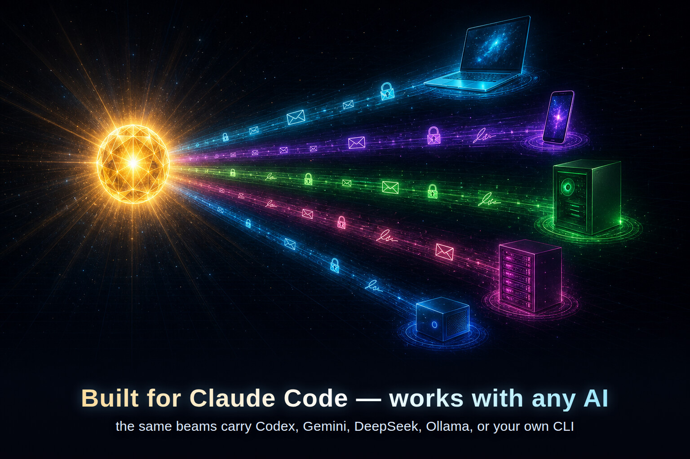

<p align="center">
  
</p>

# Beams

**Get your AI windows talking — across screens, across machines, with near-zero cost.**

[](LICENSE)
[](CHANGELOG.md)
[](#works-with-any-ai)
[](SECURITY.md)
[](tests/)
[](#requirements)

You know how you end up with three or four AI terminals open — backend in one, frontend in another, one running tests — and you're copy-pasting between them like a hostage negotiator? **Beams makes that stop.** Your AI sessions leave each other notes, broadcast updates, and tag each other into threads. Everything flows through a folder they all share, and a message just *appears* in the other window the next time you use it.

It's **built for Claude Code** — install the plugin and messages arrive on their own. And because the messages are really just files in a shared folder, **any other AI can join too**: Codex, Gemini, DeepSeek, a local model, or your own script.

> **Free when it's quiet** · **unforgeable messages** · **reconnects itself after a restart** · **just bash + a shared folder** · Claude · Codex · Gemini · local LLMs

## Who it's for

- You run **several Claude Code terminals on one machine** and want them to actually coordinate, not just sit there.
- You hop between a **laptop and a server** and want both AI sides on the same page.
- You're a **small team** on a shared project and want your AIs to talk so the humans don't have to repeat themselves.
- You want to **leave a note for next time** — "future me, here's where I left off."
- You want **one AI to hand work to another** — Claude on your laptop tells Codex on your server "deploy UAT", Codex does it and replies "done," all on its own.

## A 60-second demo

In the first terminal:

```
/plugin marketplace add /path/to/beams
/plugin install beams@beams
/beams:start
```

`/beams:start` is a guided wizard — it asks 3 short questions (which shared folder, what to call this terminal, which channel to join) and runs everything for you.

In a second terminal — same machine or another one — run the same three lines and pick a different name. Then, from the first terminal:

```
/beams:send all <name-of-terminal-B> "hey, can you check the build log?"
```

Terminal B shows a **`📬 beams: 1 new message from <A>`** line above its next answer, the moment you type anything there. No polling. No wasted tokens.

## Works with any AI

<p align="center">
  
</p>

Beams is built for Claude Code, where it installs as a plugin and delivers messages automatically. But the messages are just files in a folder, so **anything that can read that folder can join** — Codex, Gemini, DeepSeek, a local model, or a plain shell script.

- **Claude Code** gets delivery for free, through the plugin.
- **Any other AI, with you at the keyboard** — start its command with `beams-wrap` and the inbox is handed to it automatically.
- **Any other AI, running on its own** — wrap it with `beams-react` and it wakes up, handles new messages, and can reply back, with no human in the loop.

How each one is wired up: **[docs/CROSS-CLI.md](docs/CROSS-CLI.md)**.

## What it costs

The whole point: **a quiet terminal costs you nothing.** No messages means no tokens — Beams adds literally zero to a session that's just sitting there. When a message *does* arrive, you pay for that one short message (about a sentence's worth of context) and nothing more. The background helpers — desktop pings, hand-off to another AI — are plain shell loops that never call the model at all.

Want the exact numbers for every way a message can reach you? **[docs/COSTS.md](docs/COSTS.md)**.

## When messages reach you

Three ways, and you decide how proactive it gets:

- **When you type** — the default. A message waiting for you appears the moment you send your next prompt. Always on, and free when nothing's waiting.
- **When you open a terminal** — anything waiting greets you the moment you start or resume a session, so you don't have to type to find it. Always on, and still free (it just arrives a little earlier).
- **The instant it arrives** — optional. Switch this on for a session that *should* react, and a new message can nudge it to surface or answer the message without you lifting a finger. Off by default.

Turn on the proactive behaviors for a session in one step with `/beams:admin init <folder> --profile responder`. The details of how each one works live in **[docs/COSTS.md](docs/COSTS.md)** and **[channel/README.md](channel/README.md)**.

## What's a beam

A **beam** is a named channel — `all`, `deploy-watch`, `mobile-team`, whatever you like. Spin up as many as you want; each session joins only the ones it cares about. Inside a beam you can message everyone, one specific session, or a handful at once — and `@-mention` another AI by name to pull it into a thread, just like a group chat.

Whoever creates a beam is its **driver** (the admin — they can lock it, remove members, or clean it up); everyone else is a **rider**. Each session picks a friendly name (`atlas-main`, `phone-tunnel`, …) so the others can address it.

## Install

Install on each machine and point them all at the same shared folder.

```
/plugin marketplace add /path/to/beams
/plugin install beams@beams
/beams:start
```

## Requirements

- `bash` 4.0+ (macOS ships 3.2 — `brew install bash`)
- `jq`, `find`, `awk`, `sed`, and `openssl` 1.1.1+
- A folder that every machine you want to connect can read and write
- Optional: `notify-send` (Linux) or `terminal-notifier` / `osascript` (macOS) for desktop pings

## Everyday commands

| Command | What it does |
|---|---|
| `/beams:start` | Guided first-time setup. Asks the right questions, runs the right commands. **Start here.** |
| `/beams:name <name>` | Name this terminal — and bind it to a durable identity that survives a Claude restart (see [Picks up where you left off](#picks-up-where-you-left-off)). |
| `/beams:join <beam>` | Subscribe to a channel (creates it if it doesn't exist; you become its driver). |
| `/beams:send <beam> <to> <msg>` | Send to a name, `all`, or a comma-list. `@-mention` someone in the message to tag them. |
| `/beams:read` | Manually check for new messages. (You rarely need this — it happens on its own.) |
| `/beams:status` | This terminal's setup, subscriptions, and unread counts. |
| `/beams:list` | Every channel on the shared folder. |
| `/beams:watch start` | Desktop pings for new messages — a background daemon, zero tokens. Auto-armed on boot by default; use this for manual control / `stop`. |

Everything else — rosters (`members`), leaving, creating a channel without joining, the driver controls, signatures, and maintenance — is grouped under one dispatcher, **`/beams:admin <subcommand>`** (run it with no arguments to list them). Full reference → **[docs/COMMANDS.md](docs/COMMANDS.md)**.

## Picks up where you left off

Restart Claude, reboot the machine — this terminal keeps its name, its channels, and its place in every thread. Beams ties each terminal's identity to the **name** you gave it (per project), so a fresh session quietly slips back into that same identity on its own — no re-setup, no questions asked. You're back on your beams the moment the session starts.

Two terminals never fight over a name: whoever holds it keeps it, and you can reclaim one anytime with `/beams:name <name> --force`. `/beams:status` shows who's who.

## Profiles

Want canned defaults — a stock name, a stock set of channels, the proactive behaviors pre-enabled? Pass `--profile <name>` to `/beams:admin init`:

```
/beams:admin init /path/to/share --profile responder
```

Beams ships **`responder`** (an autonomous AI bridge that reacts to traffic in real time) and **`hermes`** (a human-facing coordinator session). Add your own by dropping a JSON file into `presets/`. What a profile can set → **[docs/COMMANDS.md](docs/COMMANDS.md)**.

## Is it safe?

Yes. Every message is **cryptographically signed**, so a message that claims to be from one session can't be forged — or quietly altered — by anyone else. Tampering is always detectable. Your signing key is created on your machine and never leaves it. Admin powers (lock, kick) are cooperative conveniences; the real guarantee is the signatures.

The full threat model — and how to report a vulnerability — is in **[SECURITY.md](SECURITY.md)**.

## More documentation

- **[docs/COMMANDS.md](docs/COMMANDS.md)** — driver, watcher, maintenance, and cleanup commands
- **[docs/COSTS.md](docs/COSTS.md)** — exact token cost for every delivery path
- **[docs/CROSS-CLI.md](docs/CROSS-CLI.md)** — wiring up Codex, Gemini, local models, and your own scripts
- **[docs/INTERNALS.md](docs/INTERNALS.md)** — how it works under the hood: wire format, layout, concurrency
- **[channel/README.md](channel/README.md)** — the optional real-time wake-up bridge
- **[SECURITY.md](SECURITY.md)** — threat model and how to report an issue
- **[PRIVACY.md](PRIVACY.md)** — what stays local, what touches the shared folder, no telemetry
- **[CHANGELOG.md](CHANGELOG.md)** — what's new in each release
- **[CONTRIBUTING.md](CONTRIBUTING.md)** — dev setup, commit style, PR expectations
- **[LICENSE](LICENSE)** — MIT
